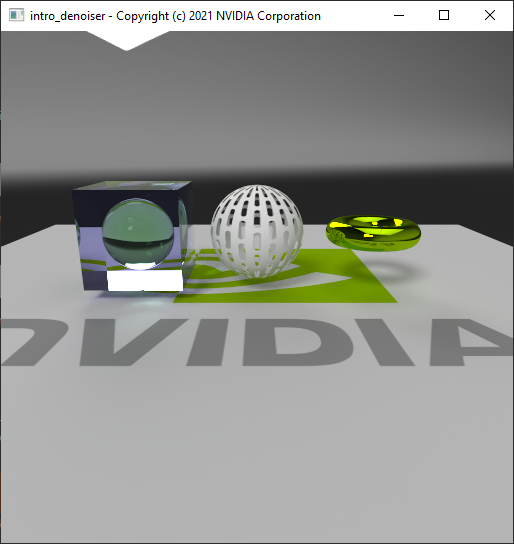
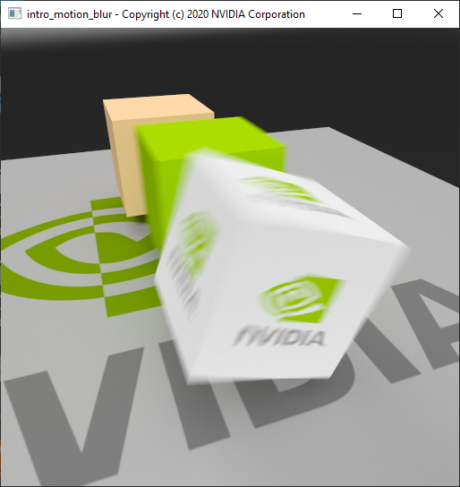
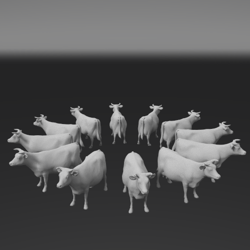
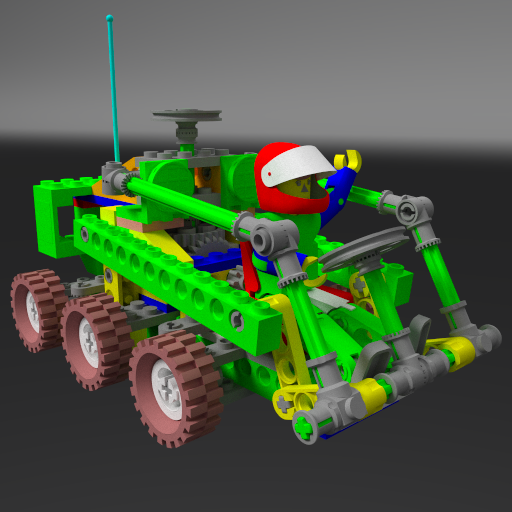

# OptiX Applications

Advanced Samples for the [NVIDIA OptiX 7 Ray Tracing SDK](https://developer.nvidia.com/optix)

The goal of the three initial introduction examples is to show how to port an existing OptiX application based on the previous OptiX 5 or 6 API to OptiX 7.

For that, two of the existing [OptiX Introduction Samples](https://github.com/nvpro-samples/optix_advanced_samples/tree/master/src/optixIntroduction) have been ported to the OptiX 7 SDK.

*intro_runtime* and *intro_driver* are ports from *optixIntro_07*, and *intro_denoiser* is a port of the *optixIntro_10* example showing the built-in AI denoiser.
Those are already demonstrating some advanced methods to architect renderers using OptiX 7 on the way.

If you need a basic introduction into OptiX 7 programming, please refer to the [OptiX 7 SIGGRAPH course material](https://github.com/ingowald/optix7course) first and maybe read through the [OptiX developer forum](https://forums.developer.nvidia.com/c/gaming-and-visualization-technologies/visualization/optix/167) as well for many topics about OptiX 7.

The landing page for online NVIDIA ray tracing programming guides and API reference documentation can be found here: [NVIDIA ray tracing documentation](https://raytracing-docs.nvidia.com/). This generally contains more up-to-date information compared to documents shipping with the SDKs and is easy to search including cross-reference links.

Please always read the OptiX SDK Release Notes before setting up a development environment.

# Overview

OptiX 7 applications are written using the CUDA programming APIs. There are two to choose from: The CUDA Runtime API and the CUDA Driver API.

The CUDA Runtime API is a little more high-level and usually requires a library to be shipped with the application if not linked statically, while the CUDA Driver API is more explicit and always ships with the NVIDIA display drivers. The documentation inside the CUDA API headers cross-reference the respective function names of each other API.

To demonstrate the differences, **intro_runtime** and **intro_driver** are both a port of [OptiX Introduction sample #7](https://github.com/nvpro-samples/optix_advanced_samples/tree/master/src/optixIntroduction/optixIntro_07) just using the CUDA Runtime API resp. CUDA Driver API for easy comparison.

**intro_denoiser** is a port from [OptiX Introduction sample #10](https://github.com/nvpro-samples/optix_advanced_samples/tree/master/src/optixIntroduction/optixIntro_10) to OptiX 7.
That example is the same as *intro_driver* with additional code demonstrating the built-in denoiser functionality with HDR denoising on beauty and optional albedo and normal buffers, all in `float4` and `half4` format (compile time options in `config.h`).

**intro_motion_blur** demonstrates how to implement motion blur with linear matrix transforms, scale-rotate-translate (SRT) motion transforms, and optional camera motion blur in an animation timeline where frame number, frames per seconds, object velocity and angular velocity of the rotating object can be changed interactively.
It's also based on *intro_driver* which makes it easy to see the code differences adding the transform and camera motion blur. 
*intro_motion_blur* will only be built when the OptiX SDK 7.2.0 or newer is found, because that version removed the `OptixBuildInputInstanceArray` `aabbs` and `numAabbs` fields which makes adding motion blur a lot simpler.

All four *intro* examples implement the exact same rendering with their scene data generated at runtime and make use of a single device (ordinal `0`) only.
(If you have multiple NVIDIA devices installed you can switch between them, by using the `CUDA_VISIBLE_DEVICES` environment variable.)

**rtigo3** is meant as a testbed for multi-GPU rendering distribution and OpenGL interoperability.
There are different multi-GPU strategies implemented (single GPU, dual GPU peer-to-peer, multi-GPU pinned memory, multi-GPU local distribution and compositing).
Then there are three different OpenGL interop modes (none, render to pixel buffer object, copy to mapped texture array).

The implementation is using the CUDA Driver API on purpose because that allows more fine grained control over CUDA contexts and devices and alleviates the need to ship a CUDA runtime library when not using the static version.

This example contains the same runtime generated geometry as the introduction examples, but also implements a simple file loader using [ASSIMP](https://github.com/assimp/assimp) for triangle mesh data.
The application operation and scene setup is controlled by two simple text files which also allows generating any scene setup complexity for tests.
It's not rendering infinitely as the introduction examples but uses a selectable number of camera samples, as well as render resolutions independent of the windows client area.

**nvlink_shared** demonstrates peer-to-peer sharing of texture data and/or geometry acceleration structures among GPU devices in an NVLINK island.
Peer-to-peer device resource sharing can effectively double the scene size loaded onto a dual-GPU NVLINK setup.
Texture sharing comes at a moderate performance cost while geometry acceleration structure and vertex attribute sharing can be considerably slower and depends on the use case, but it's reasonably fast given the bandwidth difference between NVLINK and VRAM transfers. Still a lot better than not being able to load a scene at all on a single board.

To determine the system's NVLINK topology it uses the NVIDIA Management Library [NVML](https://developer.nvidia.com/nvidia-management-library-nvml) which is loaded dynamically.
Headers for that library are shipped with the CUDA Toolkits and the library ships with the the display drivers.
The implementation is prepared to fetch all NVML entry points, but currently only needs six functions for the required NVLINK queries and GPU device searches.
Note that peer-to-peer access under Windows requires Windows 10 64-bit and SLI enabled inside the NVIDIA Display Control Panel. Under Linux it should work out of the box.

This example is derived from rtigo3, but uses only one rendering strategy ("local-copy") and while it also runs on single GPU systems, the CUDA peer-to-peer sharing functionality will obviously only run on multi-GPU NVLINK systems.
The Raytracer class got more smarts over the Device class because the resource distribution decisions need to happen above the devices.
The scene description format has been slightly changed to allow different albedo and/or cutout opacity textures per material reference.
Still it's a slightly newer application architecture compared to rtigo3 when you're planning to derive own applications from these examples.

**User Interaction inside the examples**:
* Left Mouse Button + Drag = Orbit (around center of interest)
* Middle Mouse Button + Drag = Pan (The mouse ratio field in the GUI defines how many pixels is one unit.)
* Right Mouse Button + Drag = Dolly (nearest distance limited to center of interest)
* Mouse Wheel = Zoom (1 - 179 degrees field of view possible)
* SPACE  = Toggle GUI display on/off

Additionally in rtigo3:
* S = Saves the current system description settings into a new file (e.g. to save camera positions)
* P = Saves the current tonemapped output buffer to a new PNG file. (Destination folder must exist! Check the `prefixScreenshot` option inside the *system* text files.)
* H = Saves the current linear output buffer to a new HDR file.

# Building

In the following paragraphs, the `*` in all `OptiX7*` expressions stands for the minor OptiX version digit (0 to 5).

The application framework for all these examples uses GLFW for the window management, GLEW 2.1.0 for the OpenGL functions, DevIL 1.8.0 (optionally 1.7.8) for all image loading and saving, local ImGUI code for the simple GUI, and for *rtigo3* and *nvlink_shared*, ASSIMP to load triangle mesh geometry. 
GLEW 2.1.0 is required for *rtigo3* and *nvlink_shared* for the UUID matching of devices between OpenGL and CUDA which requires a specific OpenGL extension not supported by GLEW 2.0.0. The intro examples compile with GLEW 2.0.0 though.

The top-level `CMakeLists.txt` file will try to find all currently released OptiX 7 SDK versions via the `FindOptiX7*.cmake` scripts inside the `3rdparty/CMake` folder.
These search OptiX SDK 7.0.0 to 7.5.0 locations by looking at the resp. `OPTIX7*_PATH` environment variables a developer can set to override the default SDK locations.
If those environment variables are not set, the scripts try the default SDK installation folders. Since OptiX 7 is a header-only API, only the include directory is required. 
The scripts set the resp. `OptiX7*_FOUND` CMake variables which are later used to select which examples are built at all (*intro_motion_blur* requires OptiX SDK 7.2.0 or newer) and with which OptiX SDK.
The individual applications' `CMakeLists.txt` files are setup to use the newest OptiX SDK found and automatically handle API differences via the `OPTIX_VERSION` define.

When using OptiX SDK 7.5.0 and CUDA Toolkit 11.7 or newer, the OptiX device code will automatically be compiled to the new binary OptiX Intermediate Representation (OptiX IR) instead of PTX code.
This can be changed inside the CMakeLists.txt files of the individual examples by commenting out the three lines enabling `USE_OPTIX_IR` and setting nvcc target option `--optixir` and the `*.opitxir` filename extension.

**Windows**

Pre-requisites:
* NVIDIA GPU supported by OptiX 7 (Maxwell GPU or newer, RTX boards highly recommended.)
* Display drivers supporting OptiX 7.x. (Please refer to the individual OptiX Release Notes for the supported driver versions.)
* Visual Studio 2017, 2019 or 2022
* CUDA Toolkit 10.x or 11.x. (Please refer to the OptiX Release Notes for the supported combinations.)
* Any OptiX SDK 7.x.0. (OptiX SDK 7.5.0 recommended. intro_motion_blur requires 7.2.0 or higher.)
* CMake 3.17 or newer. (Tested with CMake 3.22.1.)

(This looks more complicated than it is. With the pre-requisites installed this is a matter of minutes.)

3rdparty library setup:
* From the Windows *Start Menu* (Windows' search bar might not find it!), open the *x64 Native Tools Command Prompt for VS2017* or *x64 Native Tools Command Prompt for VS2019* or *x64 Native Tools Command Prompt for VS2022*
* Change directory to the folder containing the `3rdparty.cmd`
* Execute the command `3rdparty.cmd`. This will automatically download GLFW 3.3, GLEW 2.1.0, and ASSIMP archives from sourceforge.com or github.com (see `3rdparty.cmake`) and unpack, compile and install them into the existing `3rdparty` folder in a few minutes.
* Close the *x64 Native Tools Command Prompt* after it finished.
* The *Developer's Image Library* [DevIL](http://openil.sourceforge.net/) needs to be downloaded manually.
  * Go to the *Download* section there and click on the *DevIL 1.8.0 SDK for Windows* link to download the headers and pre-built libraries.
  * If the file doesn't download automatically, click on the *Problems Downloading?* button and click the *direct link* at the top of the dialog box.
  * Unzip the archive into the new folder `optix_apps/3rdparty/devil_1_8_0` so that this directly contains `include` and `lib` folders from the archive.
* Optionally the examples can be built with the DevIL 1.7.8 version which also contains support for EXR images.
  * Follow this link to find various pre-built [DevIL Windows SDK](https://sourceforge.net/projects/openil/files/DevIL%20Windows%20SDK/) versions.
  * Download the `DevIL-SDK-x64-1.7.8.zip` from its respective `1.7.8` folder.
  * If the file doesn't download automatically, click on the *Problems Downloading?* button and click the *direct link* at the top of the dialog box.
  * Unzip the archive into the new folder `optix_apps/3rdparty/devil_1_7_8` so that this directly contains the `include`, `unicode` and individual `*.lib` and `*.dll` files from the archive.
  * Note that the folder hierarchy in that older version is different than in the current 1.8.0 release that's why there is a `FindDevIL_1_8_0.cmake` and a `FindDevIL_1_7_8.cmake` inside the `3rdparty/CMake` folder.
  * To switch all example projects to the DevIL 1.7.8 version, replace `find_package(DevIL_1_8_0 REQUIRED)` in all CMakeLists.txt files against `find_package(DevIL_1_7_8 REQUIRED)`

Generate the solution:
* If you didn't install the OptiX SDK 7.x into its default directory, set the resp. environment variable `OPTIX7*_PATH` to your local installation folder (or adjust the `FindOptiX7*.cmake` scripts).
* From the Start menu Open CMake (cmake-gui).
* Select the `optix_apps` folder in the *Where is the source code* field.
* Select a new build folder inside the *Where to build the binaries*.
* Click *Configure*. (On the very first run that will prompt to create the build folder. Click OK.)
* Select the Visual Studio version which matches the one you used to build the 3rdparty libraries. You must select the "x64" version! (Note that newer CMake GUI versions have that in a separate listbox named "Optional platform for generator".)
* Click *Finish*. (That will list all examples' `PROJECT_NAME` and the resp. include directories and libraries used inside the CMake GUI output window the first time a `find_package()` is called. Control that this found all the libraries in the 3rdparty folder and the desired OptiX 7.x include directory. If multiple OptiX SDK 7.x are installed, the highest minor version is used.)
* Click *Generate*.

Building the examples:
* Open Visual Studio 2017, 2019 resp. 2022 (matching the version with which you built the 3rd party libraries and generated the solution) and load the solution from your build folder.
* Select the *Debug* or *Release* *x64* target and pick *Menu* -> *Build* -> *Rebuild Solution*. That builds all projects in the solution in parallel.

Adding the libraries and data (Yes, this could be done automatically but this is required only once.):
* Copy the x64 library DLLs: `cudart64_<toolkit_version>.dll, glew32.dll, DevIL.dll, ILU.dll, ILUT.dll assimp-vc<compiler_version>-mt.dll` into the build folder with the executables (*bin/Release* or *bin/Debug*). (E.g. `cudart64_101.dll` from CUDA Toolkit 10.1 and `assimp-vc143-mt.dll` from the `3rdparty/assimp` folder when building with MSVS 2022.)
* IMPORTANT: Copy all files from the `data` folder into the build folder with the executables (`bin/Release` or `bin/Debug`). The executables search for the texture images relative to their module directory.

**Linux**

Pre-requisites:
* NVIDIA GPU supported by OptiX 7 (Maxwell GPU or newer, RTX boards highly recommended.)
* Display drivers supporting OptiX 7.x. (Please refer to the individual OptiX Release Notes for the supported driver versions.)
* GCC supported by CUDA 10.x or CUDA 11.x Toolkit
* CUDA Toolkit 10.x or 11.x. (Please refer to the OptiX Release Notes for the supported combinations.)
* Any OptiX SDK 7.x version (OptiX SDK 7.5.0 recommended. intro_motion_blur requires 7.2.0 or higher.)
* CMake 3.17 or newer.
* GLFW 3
* GLEW 2.1.0 (required to build *rtigo3* and *nvlink_shared*. In case the Linux package manager only supports GLEW 2.0.0, here is a link to the [GLEW 2.1.0](https://sourceforge.net/projects/glew/files/glew/2.1.0) sources.)
* DevIL 1.8.0 or 1.7.8. When using 1.7.8 replace `find_package(DevIL_1_8_0 REQUIRED)` against `find_package(DevIL_1_7_8 REQUIRED)`
* ASSIMP

Build the Examples:
* Open a shell and change directory into the local `optix_apps` source code repository:
* Issue the commands:
* `mkdir build`
* `cd build`
* `OPTIX75_PATH=<path_to_optix_7.5.0_installation> cmake ..` 
  * Similar for all other OptiX 7.x.0 SDKs by changing the minor version number accordingly.
* `make`
* IMPORTANT: Copy all files from the `data` folder into the `bin` folder with the executables. The executables search for the texture images relative to their module directory.

Instead of setting the temporary OPTIX75_PATH environment variable, you can also adjust the line `set(OPTIX75_PATH "~/NVIDIA-OptiX-SDK-7.5.0-linux64")` inside the `3rdparty/CMake/FindOptiX75.cmake` script to your local OptiX SDK 7.5.0 installation. Similar for the other OptiX 7.x.0 versions.

# Running

IMPORTANT: When running the examples from inside the debugger, make sure the working directory points to the folder with the executable because files are searched relative to that. In Visual Studio that is the same as `$(TargetDir)`. The default is `$(ProjectDir)` which will not work!

Open a command prompt and change directory to the folder with the executables (same under Linux, just without the .exe suffix.)

Issue the commands (same for *intro_driver*, *intro_denoiser* and *intro_motion_blur*):
* `intro_runtime.exe`
* `intro_runtime.exe --miss 0 --light`
* `intro_runtime.exe --miss 2 --env NV_Default_HDR_3000x1500.hdr`

Issue the commands (similar for the other scene description files):

* `rtigo3.exe -s system_rtigo3_cornell_box.txt -d scene_rtigo3_cornell_box.txt`
* `rtigo3.exe -s system_rtigo3_single_gpu.txt -d scene_rtigo3_geometry.txt`
* `rtigo3.exe -s system_rtigo3_single_gpu_interop.txt -d scene_rtigo3_instances.txt`

The following scene description uses the [Buggy.gltf](https://github.com/KhronosGroup/glTF-Sample-Models/tree/master/2.0/Buggy/glTF) model from Khronos which is not contained inside this source code repository.
The link is also listed inside the `scene_rtigo3_models.txt` file.

* `rtigo3.exe -s system_rtigo3_single_gpu_interop.txt -d scene_rtigo3_models.txt`

If you run a multi-GPU system, read the `system_rtigo3_dual_gpu_local.txt` for the modes of operation and interop settings.

* `rtigo3.exe -s system_rtigo3_dual_gpu_local.txt -d scene_rtigo3_.txt`

The nvlink_shared example is meant for multi-GPU systems with NVLINK bridge. It's working on single-GPU setups as well though. I've prepared a geometry-heavy scene with 125 spheres of more than 1 million triangles each. That scene requires about 10 GB of VRAM on a single board.

* `nvlink_shared.exe -s system_nvlink_shared.txt -d scene_nvlink_spheres_5_5_5.txt`

# Pull Requests

NVIDIA is happy to review and consider pull requests for merging into the main tree of the optix_apps for bug fixes and features. Before providing a pull request to NVIDIA, please note the following:

* A pull request provided to this repo by a developer constitutes permission from the developer for NVIDIA to merge the provided changes or any NVIDIA modified version of these changes to the repo. NVIDIA may remove or change the code at any time and in any way deemed appropriate.
* Not all pull requests can be or will be accepted. NVIDIA will close pull requests that it does not intend to merge.
* The modified files and any new files must include the unmodified NVIDIA copyright header seen at the top of all shipping files.

# Support

Technical support is available on [NVIDIA's Developer Forum](https://forums.developer.nvidia.com/c/gaming-and-visualization-technologies/visualization/optix/167), or you can create a git issue.
